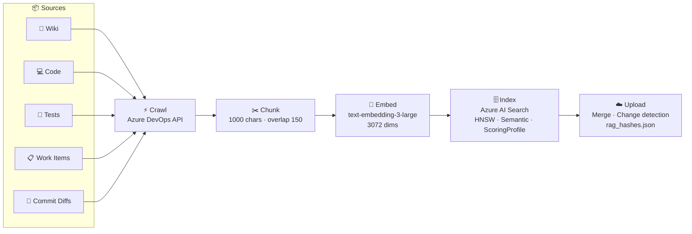
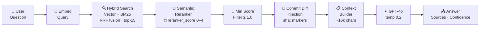

# TigerChat

> **RAG-powered chat for Azure DevOps** — ask questions, get answers grounded in your Wiki, source code, test cases, Work Items, and Commit Diffs.


---

## What is TigerChat?

TigerChat indexes your internal Azure DevOps content and lets your team ask natural-language questions about it. Answers are grounded in **five source types** — retrieved via hybrid search and answered by GPT-4o.

| Source | What gets indexed |
|---|---|
| 📄 Wiki pages | All pages across all wikis, recursively, as Markdown with discussion comments |
| 💻 Source code | `.cs` `.csproj` `.razor` `.ts` `.js` `.json` `.xml` `.config` and more (up to 100 KB) |
| 🧪 Test cases | All test cases with steps, expected results, shared steps resolved, and discussion threads |
| 📋 Work Items | Epics, Features, User Stories, Tasks, and Bugs — with descriptions, acceptance criteria, linked items, comments, and attachments |
| 🔀 Commit Diffs | Unified before/after diffs for every commit linked to a Bug or Task, including NuGet package change tables |

---

## Architecture

### Ingestion Pipeline



### Query Pipeline



---

## Confidence Signal

Each answer carries a **High / Medium / Low** confidence badge derived from the semantic reranker score:

| Signal | Condition |
|---|---|
| 🟢 **High** | `reranker_score ≥ 2.5` AND `chunks ≥ 3` |
| 🟡 **Medium** | `reranker_score ≥ 1.5` AND `chunks ≥ 2` |
| 🔴 **Low** | Weak scores, few chunks, or LLM expressed uncertainty |

> Chunks scoring below **1.0** are dropped before context is built (min-score filter).

---

## Features

- **Five-source RAG** — Wiki, source code, test cases, Work Items (Epics/Features/Stories/Tasks/Bugs), and Commit Diffs all indexed and searchable together
- **Hybrid search** — vector similarity + BM25 merged via Reciprocal Rank Fusion (RRF)
- **Semantic Reranker** — neural cross-encoder re-scores results on a 0–4 scale (Azure AI Search S1+)
- **Commit Diff injection** — Work Item chunks embed `*sha:40-char-hex*` markers; at query time diffs are fetched and injected into context for accurate PFQ-style change reports
- **NuGet package diffing** — `.csproj` changes in commits produce a `Package | Before | After` table indexed as a separate chunk
- **Source type boosting** — boost wiki / code / test / workitem results via the `BOOST_SOURCE_TYPE` env var
- **Min-score filter** — drops weakly-matched chunks before they reach GPT-4o
- **Clickable citations** — every answer links back to the source in Azure DevOps
- **Live ingestion UI** — real-time SSE progress per step with per-source controls, repo picker, test plan/suite/test-case picker, and area path picker for Work Items
- **Change detection** — MD5 hash manifest (`rag_hashes.json`) prevents re-processing unchanged content
- **Crawl-or-reprocess toggle** — re-embed without a fresh crawl when only the chunking changed
- **Markdown table rendering** — tabular content in answers is displayed as styled HTML tables (copy-paste friendly)

---

## Quick Start

```bash
git clone <repository-url>
cd TigerNuno
pip install -r requirements.txt
cp .env.example .env
# Fill in your Azure credentials in .env
uvicorn app:app --reload
```

Open **http://localhost:8000**

---

## Key Configuration

| Variable | Description | Default |
|---|---|---|
| `AZURE_DEVOPS_PAT` | PAT with Wiki · Code · Test Mgmt · Work Items (Read) | required |
| `DEVOPS_ORG` | Azure DevOps organisation | required |
| `DEVOPS_PROJECT` | Project name | required |
| `AZURE_STORAGE_CONNECTION_STRING` | Blob Storage connection string | required |
| `AZURE_STORAGE_CONTAINER` | Blob container for snapshots and manifest | `wiki-crawl` |
| `AZURE_OPENAI_ENDPOINT` | Azure OpenAI resource URL | required |
| `AZURE_OPENAI_API_KEY` | Azure OpenAI API key | required |
| `AZURE_OPENAI_EMBEDDING_DEPLOYMENT` | Embedding model deployment name | `text-embedding-3-large` |
| `AZURE_OPENAI_CHAT_DEPLOYMENT` | Chat model deployment name | `gpt-4o` |
| `AZURE_SEARCH_ENDPOINT` | Azure AI Search endpoint | required |
| `AZURE_SEARCH_API_KEY` | Azure AI Search API key | required |
| `AZURE_SEARCH_INDEX_NAME` | Search index name | `wiki-index` |
| `CRAWL_WIKI` | Include Wiki pages in ingestion | `true` |
| `CRAWL_CODE` | Include source code in ingestion | `true` |
| `CRAWL_TESTS` | Include test cases in ingestion | `true` |
| `CRAWL_WORK_ITEMS` | Include Work Items in ingestion | `true` |
| `CRAWL_COMMIT_DIFFS` | Include commit diffs in ingestion | `true` |
| `CRAWL_WI_ATTACHMENTS` | Download and embed WI code/config attachments | `true` |
| `EMBED_INTER_BATCH_DELAY_S` | Pause between embedding batches (rate-limit tuning) | `0.5` |

---

## App Routes

| Route | Description |
|---|---|
| `/` | Landing page |
| `/ingest` | Ingestion UI with live progress, repo/plan/area pickers |
| `/chat` | Chat interface with 5-source example questions |
| `/about` | How Ingestion Works |
| `/about/diffs` | How Commit Diff ingestion works |
| `/chat/about` | How Chat Works (RAG pipeline) |
| `/chat/about/scoring` | Scoring & Confidence deep-dive |
| `/synergies` | Pipeline relationship diagram |
| `/api/chat` | `POST {"question":"..."}` → `{"answer","sources","confidence"}` |
| `/api/chat/stream` | SSE stream — per-step progress then final answer |
| `/ingest/stream` | SSE stream of real-time ingestion progress |
| `/api/repos` | List available Git repositories |
| `/api/test-plans` | List all test plans |
| `/api/test-suites` | List all suites across all plans |
| `/api/areas` | Full area tree with depth info |
| `/api/areas/counts` | Work item counts per type per area |
| `/api/index/stats` | Document counts per source type in the search index |
| `/api/debug/tc/{id}` | Diagnostic: indexed chunks + raw fields for a test case |
| `/api/debug/wi/{id}` | Diagnostic: indexed chunks + ArtifactLink resolution for a WI |
| `/api/debug/wi/{id}/dev-info` | Step-by-step trace of commit resolution for a WI |

---

## PAT Token Scopes Required

Your Azure DevOps PAT must have **all four** of these scopes:

- ✅ **Wiki** — Read
- ✅ **Code** — Read
- ✅ **Test Management** — Read
- ✅ **Work Items** — Read *(required for test case details, Work Items, and commit link resolution)*

---

## Blob Storage Artefacts

| Blob | Purpose |
|---|---|
| `rag_{ORG}_{PROJECT}.jsonl` | Raw crawl snapshot — used by `crawl=OFF` re-process mode |
| `rag_hashes.json` | MD5 hash manifest — drives change detection between runs |

> **First run after setup:** both blobs are absent. The full pipeline runs and creates them. Subsequent runs skip unchanged content. `crawl=OFF` mode requires the snapshot blob to exist.

---

## Tech Stack

| Layer | Technology |
|---|---|
| Web framework | FastAPI + uvicorn |
| Crawling | Azure DevOps REST API v7.1 |
| Chunking | LangChain `RecursiveCharacterTextSplitter` (1000 chars, overlap 150) |
| Embeddings | Azure OpenAI `text-embedding-3-large` (3072 dims, batches of 200, 3 workers) |
| Search | Azure AI Search — HNSW vector + BM25 + RRF + Semantic Reranker |
| Generation | Azure OpenAI `gpt-4o` (temp 0.2) |
| Snapshot storage | Azure Blob Storage (JSONL + MD5 manifest) |
| Frontend | Vanilla HTML/CSS/JS — no framework |
