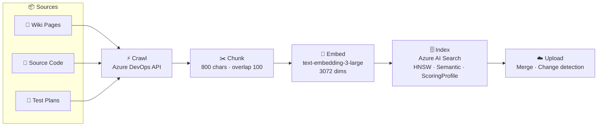
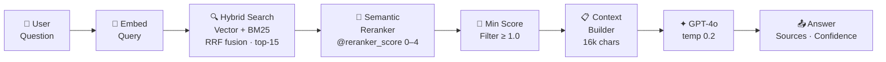

# TigerChat

> **RAG-powered chat for Azure DevOps** — ask questions, get answers grounded in your Wiki, source code and test cases.


---

## What is TigerChat?

TigerChat indexes your internal Azure DevOps content and lets your team ask natural-language questions about it. Answers are grounded in three source types — **Wiki pages**, **Git source code files**, and **Test Management cases** — retrieved via hybrid search and answered by GPT-4o.

| Source | What gets indexed |
|---|---|
| 📄 Wiki pages | All pages, recursively, as Markdown |
| 📝 Source code | `.cs` `.razor` `.ts` `.js` `.json` `.xml` `.config` and more |
| 🧪 Test plans | All test cases with steps and expected results |

---

## Architecture

### Ingestion Pipeline



### Query Pipeline



---

## Confidence Signal

Each answer carries a **High / Medium / Low** confidence badge derived from the semantic reranker score:

| Signal | Condition |
|---|---|
| 🟢 **High** | `reranker_score ≥ 2.5` AND `chunks ≥ 3` |
| 🟡 **Medium** | `reranker_score ≥ 1.5` AND `chunks ≥ 2` |
| 🔴 **Low** | Weak scores, few chunks, or LLM expressed uncertainty |

> Chunks scoring below **1.0** are dropped before context is built (min-score filter).

---

## Features

- **Three-source RAG** — Wiki, source code, and test cases all indexed and searchable together
- **Hybrid search** — vector similarity + BM25 merged via Reciprocal Rank Fusion (RRF)
- **Semantic Reranker** — neural cross-encoder re-scores results on a 0–4 scale (Azure AI Search S1+)
- **Source type boosting** — optionally boost wiki / code / test results via `BOOST_SOURCE_TYPE` env var
- **Min-score filter** — drops weakly-matched chunks before they reach GPT-4o
- **Clickable citations** — every answer links back to the source in Azure DevOps
- **Live ingestion UI** — real-time SSE progress per step with per-source controls
- **Change detection** — MD5 hash manifest prevents re-processing unchanged content
- **Crawl-or-reprocess toggle** — re-embed without a fresh crawl when only the chunking changed

---

## Quick Start

```bash
git clone <repository-url>
cd TigerNuno
pip install -r requirements.txt
cp .env.example .env
# Fill in your Azure credentials in .env
uvicorn app:app --reload
```

Open **http://localhost:8000**

---

## Key Configuration

| Variable | Description | Default |
|---|---|---|
| `AZURE_DEVOPS_PAT` | PAT with Wiki·Code·Test Mgmt·Work Items (Read) | required |
| `DEVOPS_ORG` | Azure DevOps organisation | required |
| `DEVOPS_PROJECT` | Project name | required |
| `AZURE_SEARCH_ENDPOINT` | Azure AI Search endpoint | required |
| `AZURE_OPENAI_ENDPOINT` | Azure OpenAI endpoint | required |
| `CRAWL_WIKI` | Include Wiki in ingestion | `true` |
| `CRAWL_CODE` | Include source code in ingestion | `true` |
| `CRAWL_TESTS` | Include test plans in ingestion | `true` |
| `AZURE_SEARCH_SEMANTIC_ENABLED` | Enable Semantic Reranker (S1+ required) | `true` |
| `BOOST_SOURCE_TYPE` | Boost a source: `wiki` \| `code` \| `test` \| `` | `` |

See [`.env.example`](.env.example) for the full list.

---

## App Routes

| Route | Description |
|---|---|
| `/` | Landing page |
| `/ingest` | Ingestion UI with live progress |
| `/chat` | Chat interface |
| `/about` | How Ingestion Works |
| `/chat/about` | How Chat Works (RAG pipeline) |
| `/chat/about/scoring` | Scoring & Confidence deep-dive |
| `/synergies` | Pipeline relationship diagram |
| `/api/chat` | `POST {"question":"..."}` → `{"answer","sources","confidence"}` |
| `/ingest/stream` | SSE stream of real-time ingestion progress |

---

## PAT Token Scopes Required

Your Azure DevOps PAT must have **all four** of these scopes:

- ✅ **Wiki** — Read
- ✅ **Code** — Read  
- ✅ **Test Management** — Read
- ✅ **Work Items** — Read *(separate from Test Management — required for fetching test case details)*

---

## Tech Stack

| Layer | Technology |
|---|---|
| Web framework | FastAPI + uvicorn |
| Crawling | Azure DevOps REST API v7.1 |
| Chunking | LangChain `RecursiveCharacterTextSplitter` |
| Embeddings | Azure OpenAI `text-embedding-3-large` (3072 dims) |
| Search | Azure AI Search — HNSW vector + BM25 + RRF + Semantic Reranker |
| Generation | Azure OpenAI `gpt-4o` (temp 0.2) |
| Snapshot storage | Azure Blob Storage (JSONL + MD5 manifest) |
| Frontend | Vanilla HTML/CSS/JS (no framework) |
